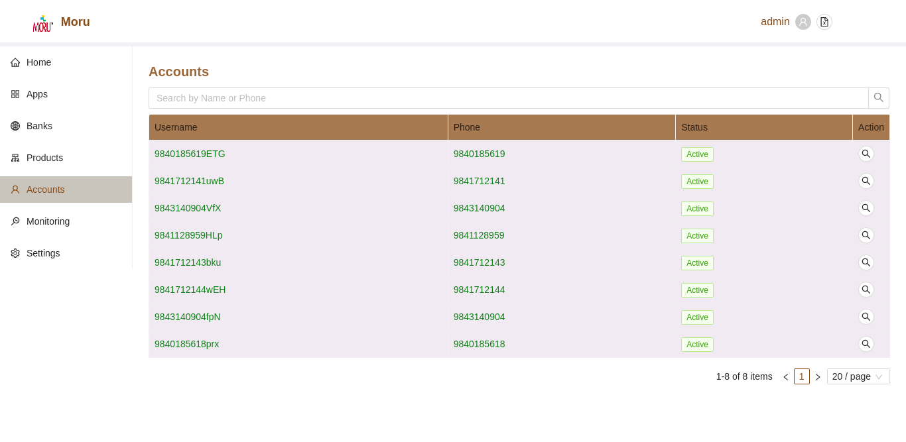
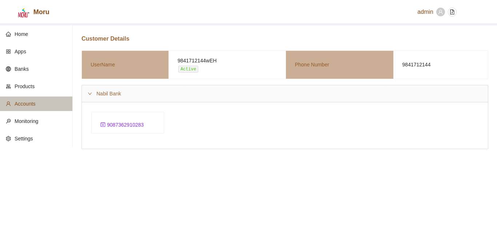

# Accounts
The Accounts Section enlists all the pre-registered Customers users. 
  

### Search Customers Customers
By default, Customers users will be listed wihtout any filters. User can filter such list by either Customers First Name or Phone Number.

* To Search simply type the value and press enter.
* To reset the filter click on the clear icon in the search box or manually delete input text and press enter

### Customers User Details

To view the additional details of Customers Users, click on the browse icon in the same row as the listed customers users.

The details of each customers user can be edited from withi the newly rendered screen.

A user can also view list of all registered banks associated with customer accounts.

*  Associated Bank List
    
    All associated Banks with the current account will have an individual tab Pane. Each of these tab pane will list corresponding accounts.