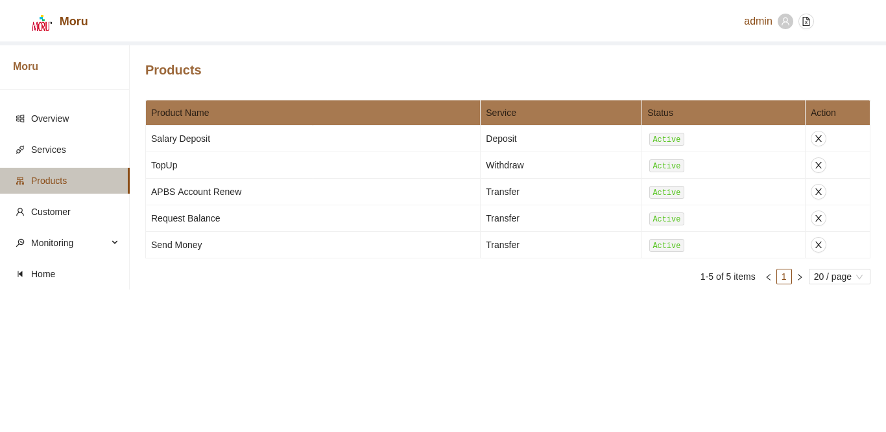
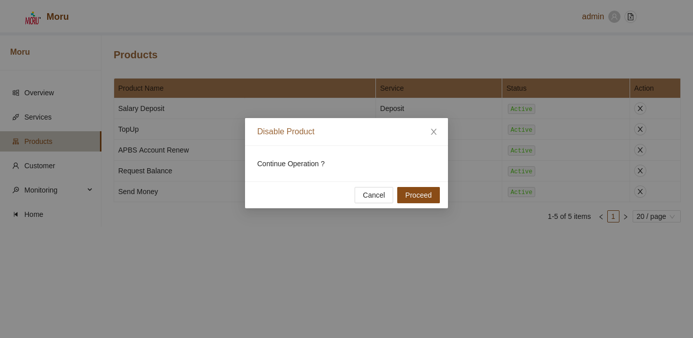

# Application Products

The Products screen within Application section will list all available products by default. The list will show the basic details including the product status configured for the application.

### Change Product Status

To change the current product status, click on the **Cross** button in the same row as selected product. User can change the status after confirming the action modal.

