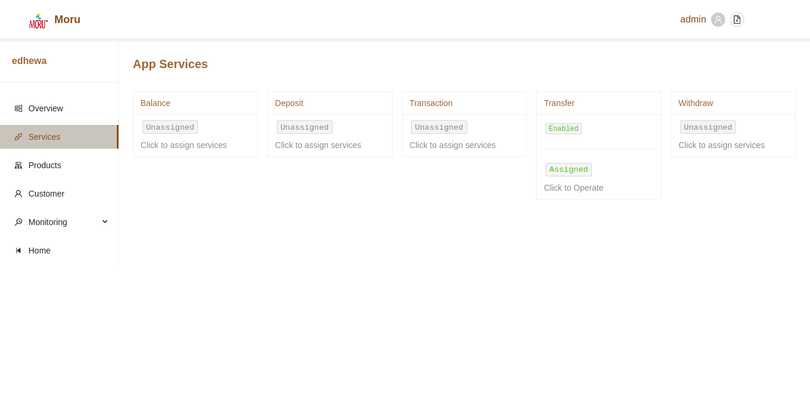
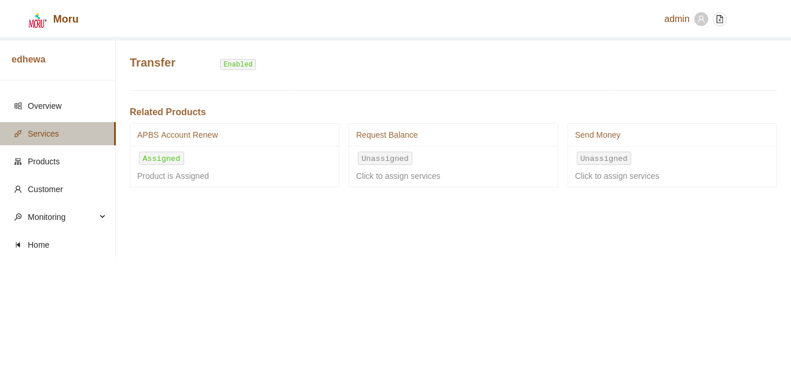
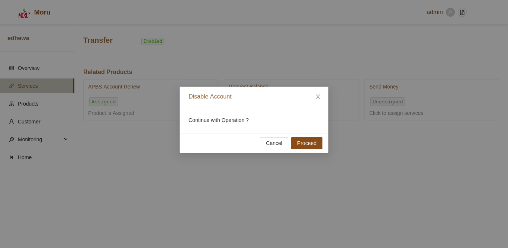

# App Services
The App Services section enlists all available services. Services previously assigned will be displayed as **assigned**, while services previously unassigned will be displayed as **unassigned**.

# Service Details and Products

To edit the status and add products to application services, simply click on the card for respective services. A new window shall appear with pre-registered products if any.

### Assign New Product Service

To assign new product Service:
* All available products will be listed in the section.
* User can click on respective cards to enable access to such products.
* Application can now request for specific product

### Change status of App Service

To enable/disable current selected app service, simply click on the status text in the top section of the Service page.

