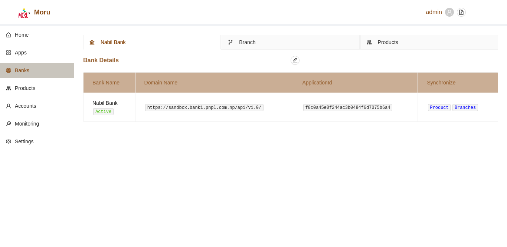
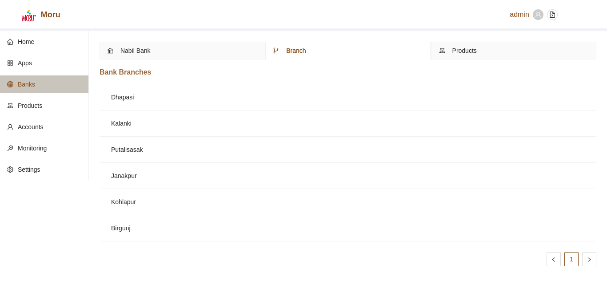
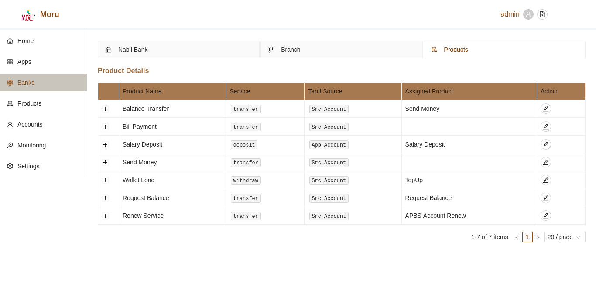
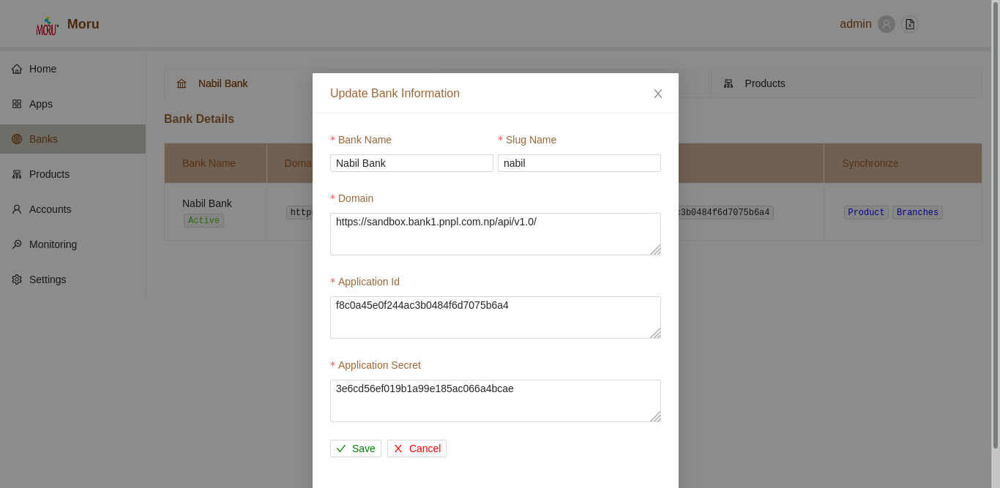
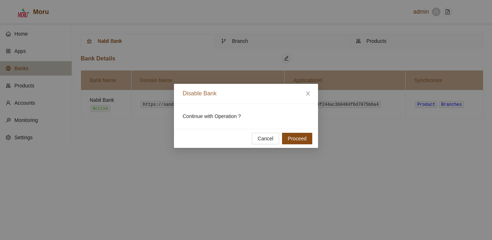

### Bank Details

To view the additional details of Banks, click on the **browse** icon in the same row as the listed business users.

The details of each banks can be edited from withi the newly rendered screen. To edit bank details, click on the edit button in the top section of bank page.

A user can also enable/disable curent bank, syc branches and products from gateway section.

* Sync Branch Information

    By default, no branch will be listed under **Branch** section. After manual syncing process i.e. By clicking **Branch** label under sync tab of bank details, all available branches of selected banks will be sync to aggregators.

* Sync Product Information

    By default, products will be automcatically synced at the time of configuration of banks and will be listed under **Products** section. User can also follow manual syncing process  at later time i.e. By clicking **Products** label under sync tab of bank details, all available products of selected banks will be sync to aggregators.

### Edit Bank Details

To edit existing information, click on the edit outlined button. A user modal will be opened to facilitate such changes.

* Click on the **+** button in the top section of Banks Page.
* A user form will be displayed.
* Fill in the relevant Details
* Click on **Save** Button to add new configuration.
* Click on **Cancel** Button to cancel current operation
* Upon successful completion of edit operation, details will be updated

### Disable/ Enable current Bank

To enable/ disable current bank, click on the status description under **Bank Name** section. A pop-up will open for user consent. Type in reason for status changes and click on proceed button.

Upon successful completion, bank status will change.
