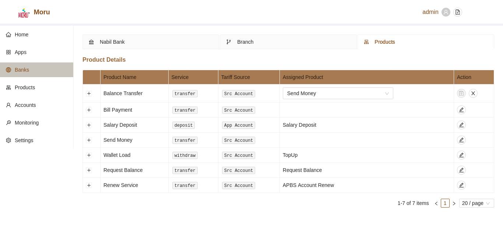

# Bank Products

All available products from bank are listed by default. The list shows the type of service, bank name and corresponding product assigned via gateway. If a product hasn't been assigned to any local services, the assigned service section will be empty.

### Assign Gateway Product to Bank Products

To assign available bank products to gateway, simply click the **Edit** button under action tab of individual row. Update the product from selection box.

Note: Slection List will have data only if Products have been registered within the aggregator from Products section.

* Click on **Edit** button
* User will now see **Save** and **Cancel** button
* Select product from selection box
* Click **Save** button to save changes
* Click **Canncel** button to disacar changes

Note: A product can only be mapped once. Duplicate mapping will result in user error.

### Product Tariff Details

To view the tariff Details of each products, simply click on the **+** button of desired product. User can now see all tariff ranges of such product as defined from APBS Gateway. The details in this section are completely for refence use and is used automatically by the system i.e. all tariff information are **readonly**.

