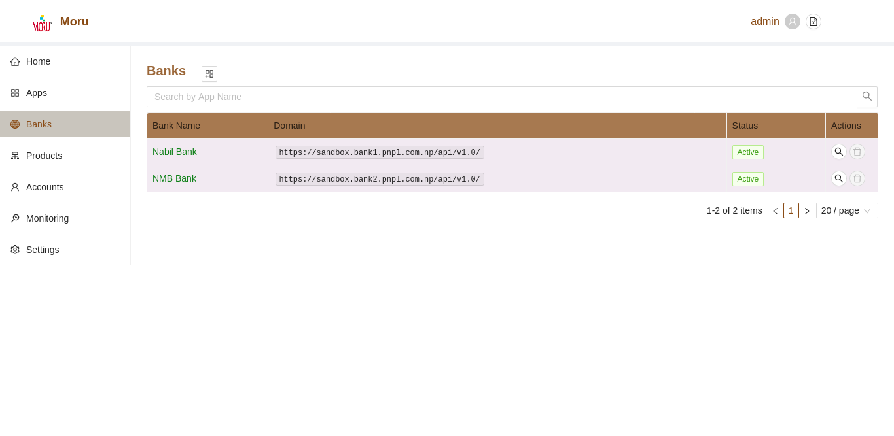
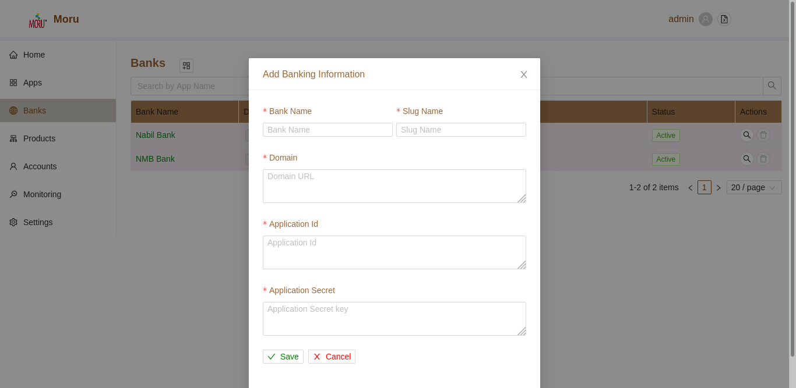

# Banks
The Bank Section enlists all the pre-configured banks. During the configuration of Banks following information are of vital importance:

* Bank Name
* Bank Domain (Url for APBS Gateway APIs)
* Bank Slug Identifier
* Application Key Id
* Application Secret Key
  

### Search Banks
By default, banks will be listed without any filters. User can filter such list by bank name. Such search operation are case insensitive.

* To Search simply type the value and press enter.
* To reset the filter click on the clear icon in the search box or manually delete input text and press enter

### Add new Bank Configuration
Bank configuration are maintained by bank (APBS Gateway) side and are just updated for operational purpose in aggregator section. Aggregator users simply update information that was forwarded via bank to them.

* Click on the **+** button in the top section of Banks Page.
* A user form will be displayed.
* Fill in the relevant Details
* Click on **Save** Button to add new configuration.
* Click on **Cancel** Button to cancel current operation
* On  successful execution of Bank COnfiguration, Bank list will be updated, corresponding products from banks are synced with aggregator.

