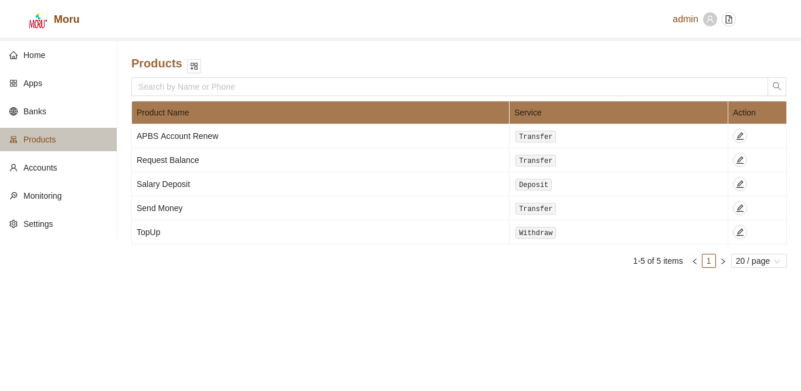
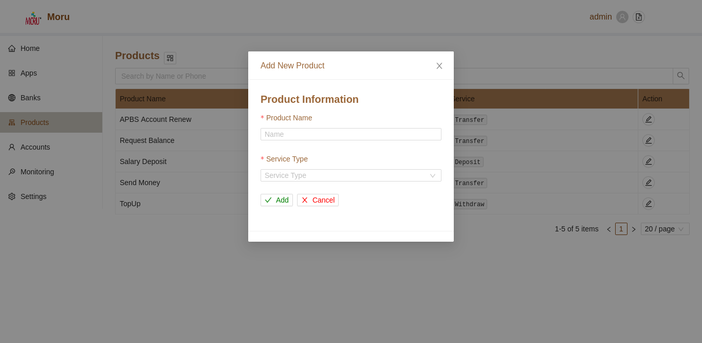
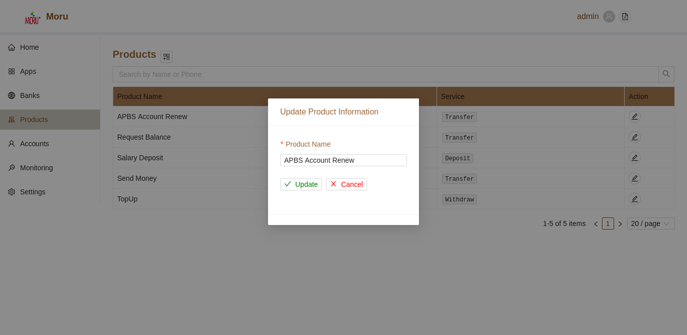

# Products

By default, all available products wihtin the gateway is listed. Minimal information regarding product name, status and associated service type is displayed in this section.

### Add New Products

User can add or edit products when required. To add a new product, simply click on the **+** button in the top section of the products page. A modal will open.
* Fill in product name
* Select service type
* Click on **Add** Button to save changes
* Click on **Cancel** Button to disacard changes
* Once, add operation is successful, the newly addded product will be listed in the section.

### Edit Existing Products

To edit Existing Product, simply click the **Edit Outlined** button for individual products. A modal will be displayed.
* Edit the product Name
* Click on **Update** to save changes
* Click on **Cancel** to discard changes

### Search Products

User can filter the current product list by search action. To search product, simply type the search value and press enter. To clear the search text, click on the cancel button in the search bar or simply delete all the search text and press **Enter**.